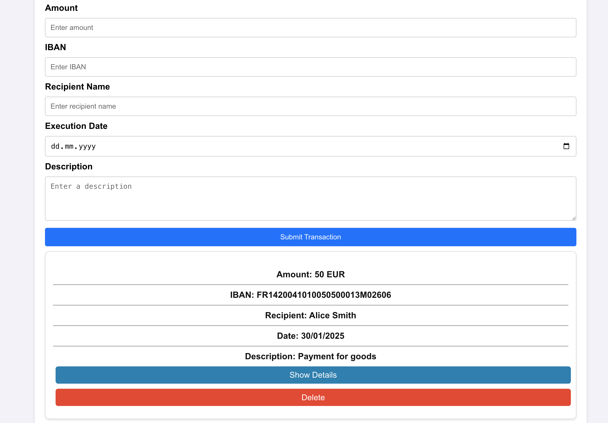

# Seminar Task: Transaction Application

Welcome to the seminar task! In this project, you'll create a simple frontend application using
**Vite**, **Vitest**, and **Vanilla JavaScript**. The goal is to build a user interface for
executing SEPA transactions. While this project focuses solely on the frontend, you will design a
clean and interactive interface for users to input and visualize transaction details.
This is how it should look like:



---

## Table of Contents

1. [Project Overview](#project-overview)
2. [Installation](#installation)
   - [Clone the Repo](#1-clone-the-repo)
   - [Install Dependencies](#2-install-dependencies)
   - [Start the Development Server](#3-start-the-development-server)
3. [Task Requirements](#task-requirements)
4. [Goal of this Task](#goal-of-this-task)
5. [Format of this Task](#format-of-this-task)

---

## Project Overview

The application will:

- Allow users to input transaction details (e.g., amount, recipient, and description).
- Display a list of submitted transactions.
- Perform basic validation on user inputs.
- Emphasize clean design and user experience.

This is an excellent opportunity to practice your frontend development skills with Vite and learn how to create lightweight, high-performance web applications.

---

## Installation

Follow the steps below to set up a **Vite** project with **Vanilla JavaScript**:

### 1. Clone the Repo

```bash
git clone https://github.com/nkxxll/transaction-app.git
git switch base # start state
```

### 2. Install Dependencies

Install the required dependencies:

```bash
npm install
```

### 3. Start the Development Server

Run the development server with:

```bash
npm run dev
```

This will start the app at [http://localhost:5173](http://localhost:5173). Open the URL in your browser to view your app.

Run the tests:

```bash
npm run test
```

## Task Requirements

As part of this task, you will:

1. **Design a Transaction Input Form:**

   - Users should be able to input details like amount, IBAN, recipient name, execution date, and
     description.

2. **Display Transactions:**

   - Show a list of submitted transactions in a clear and organized format.

3. **Validate Inputs:**

   - Ensure valid data is submitted (e.g., positive amounts, required fields filled, correct IBAN
     format, correct name format, correct date format). For the formats use common sense and some
     help from the internet if validation of the llm output is needed.

4. **Bonus (Optional):** Add basic styling to make the application visually appealing. Add a list of
   transactions under the input form.

## Goal of this Task

The main objective of this task is to explore how prompt engineering can be effectively utilized for
code generation within a vanilla JavaScript application. By the end of this seminar, participants
should be able to:

1. **Understand the Basics of Prompt Engineering**: Gain insight into how different types of prompts
   can be structured to elicit specific responses from language models, particularly in the context
   of code generation.

2. **Enhance Code Generation Accuracy**: Learn how to refine prompts to generate code snippets that
   are correct, optimized, and tailored to specific use cases.

3. **Improve Development Workflow**: Implement prompt engineering techniques to automate or speed up
   repetitive coding tasks.

4. **Adapt Prompts for Contextual Relevance**: Understand how to provide context to language models
   within prompts to generate more relevant and efficient code for real-world applications.

5. **Evaluate and Optimize Generated Code**: Assess the quality of code generated through different
   prompts and explore strategies for improving the output, ensuring that it meets performance and
   readability standards.

## Format of this Task

I will check in every 15min and tell you what your progress should look like. If you are stuck at a
specific point and you want to just get up to speed with the rest check out the specific branch for
the step that we are on.

```bash
git add -A
git commit -m "verdamte hacke ich haenge"
git switch <branch>
```

### Project Structure

1. `./src` the folder for all the code
1. `./index.html` entry point of the application which loads the `main.js` script
1. `./src/main.js` main entry point for the code will hold list and form
1. `./src/list.js` the list of the transactions will be called on submit from the main file
1. `./src/form.js` the form for entering a new transaction
1. `./src/validation.js` the validation functions for the form no html
1. `./src/validation.test.js` the validation unit test file that should include date format check,
   IBAN format check, and amount format check

### Steps

The start branch is the `base` branch.

1. Make the form (branch: `form`, time: 15min)
2. Make the validation (branch: `validation`, time: 15min)
3. List the submitted transactions (branch: `list`, time: 15min)
4. (Optional): add styling
5. (Optional): add detail view for transactions on click (branch: `detail`)

Total time estimated for the task is 1h.
